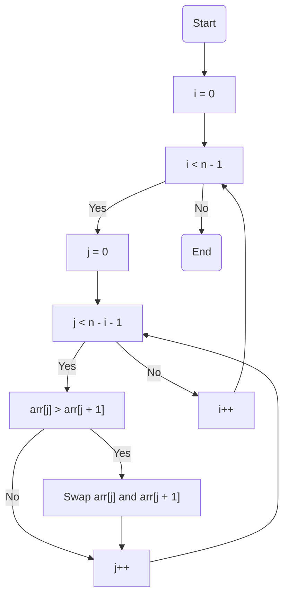
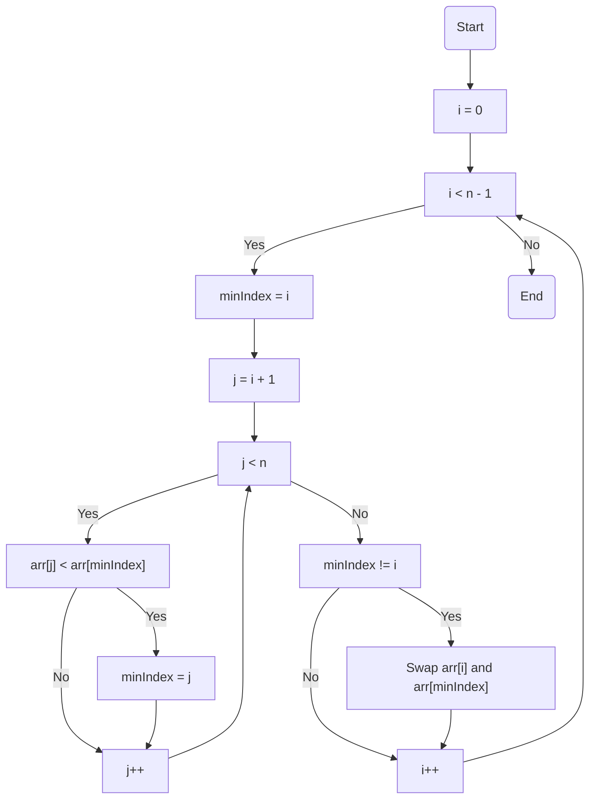
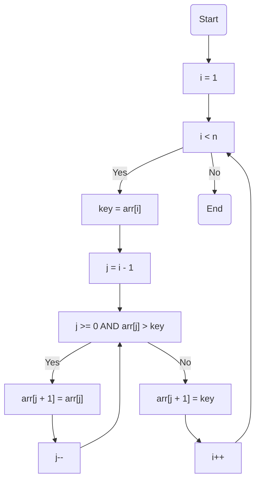
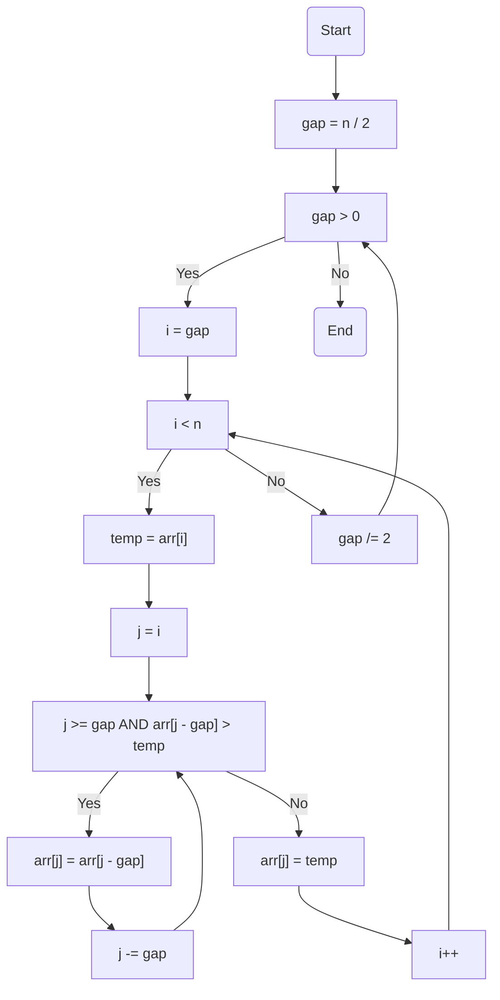
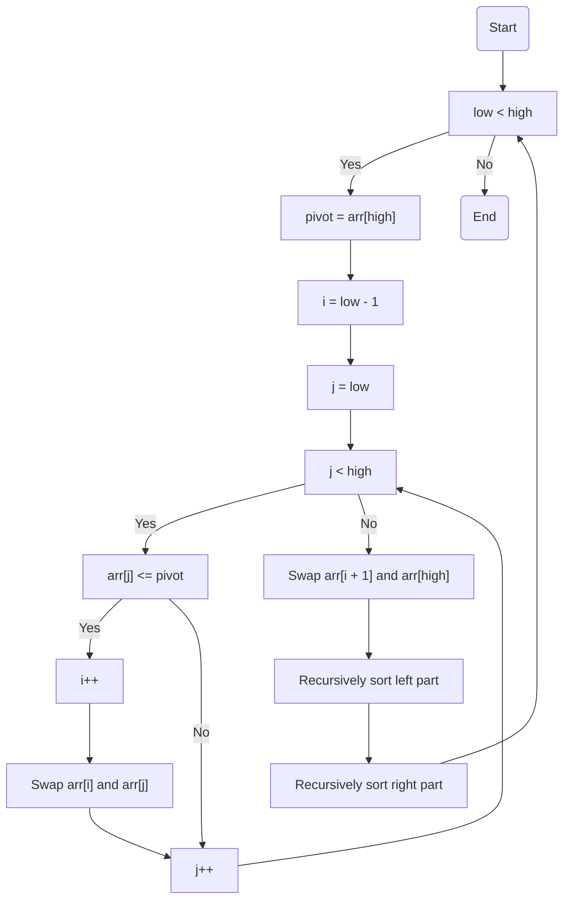
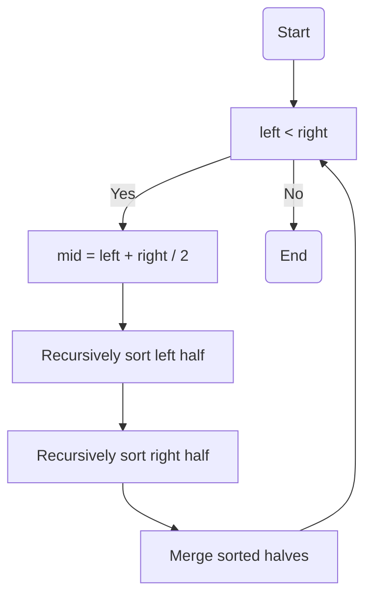
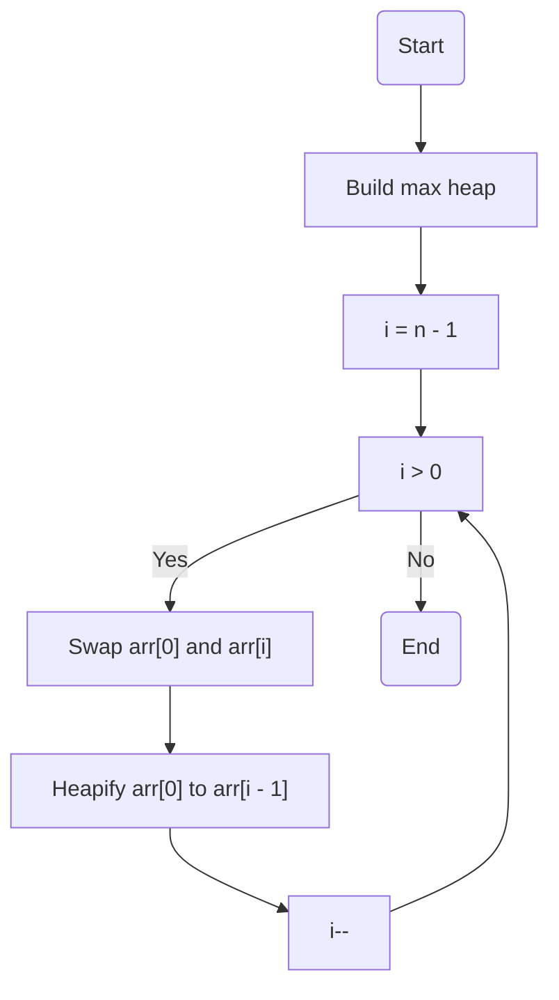
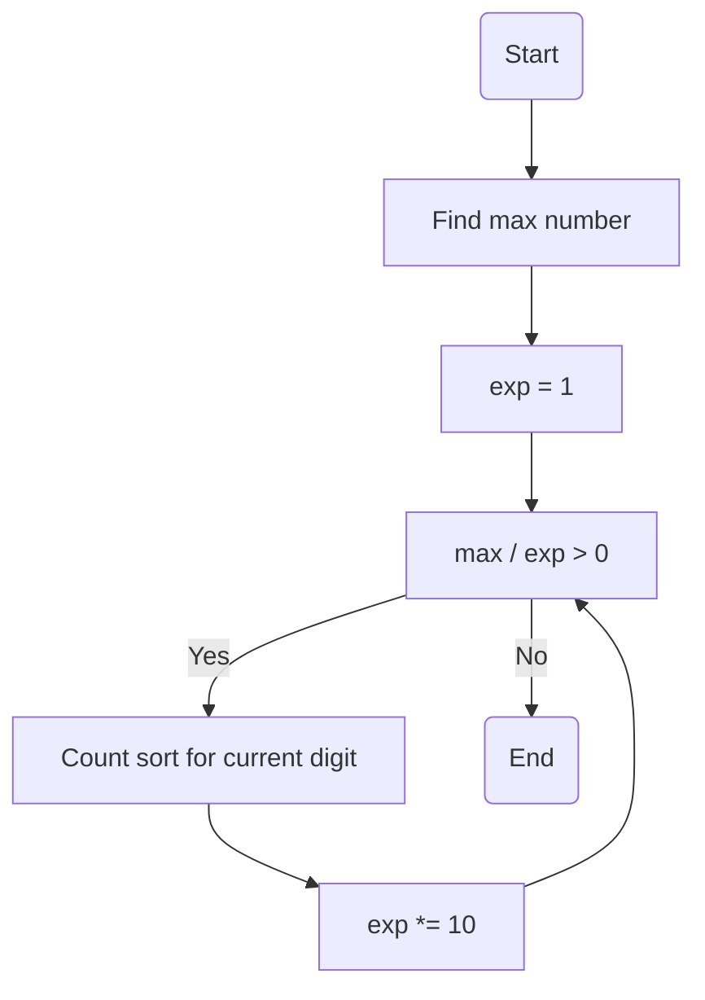

# 排序算法总结

## 1. 冒泡排序 (Bubble Sort)
通过重复遍历要排序的数组，比较相邻元素并交换它们的位置来进行排序。

### 算法步骤：
1. 比较相邻的元素，如果第一个比第二个大，就交换它们
2. 对每一对相邻元素执行相同的操作，从开始第一对到结尾的最后一对
3. 重复以上步骤，直到没有任何一对数字需要比较

## 2. 选择排序 (Selection Sort)
通过在未排序部分中找到最小元素并将其放到已排序部分的末尾来进行排序。

### 算法步骤：
1. 在未排序序列中找到最小元素
2. 将其与未排序序列的第一个元素交换
3. 重复上述步骤，直到所有元素排序完成

## 3. 插入排序 (Insertion Sort)
通过构建有序序列，对于未排序数据，在已排序序列中从后向前扫描，找到相应位置并插入。

### 算法步骤：
1. 从第二个元素开始遍历数组
2. 将当前元素与已排序部分的元素比较
3. 找到合适的位置插入当前元素

## 4. 希尔排序 (Shell Sort)
希尔排序是插入排序的改进版本，通过比较相距一定间隔的元素来进行排序。

### 算法步骤：
1. 选择一个增量序列
2. 按增量序列个数进行分组插入排序
3. 减小增量，重复上述步骤

## 5. 快速排序 (Quick Sort)
通过选择一个基准元素，将数组分为两部分，一部分比基准小，另一部分比基准大。

### 算法步骤：
1. 选择一个基准元素
2. 将小于基准的元素放在左边，大于基准的放在右边
3. 递归对左右两部分进行相同操作

## 6. 归并排序 (Merge Sort)
采用分治法，将数组分成两半，分别排序后再合并。

### 算法步骤：
1. 将数组分成两半
2. 递归地对两半进行排序
3. 合并两个已排序的部分

## 7. 堆排序 (Heap Sort)
利用堆这种数据结构所设计的一种排序算法。

### 算法步骤：
1. 构建最大堆
2. 将堆顶元素与末尾元素交换
3. 重新调整堆结构

## 8. 基数排序 (Radix Sort)
按照个位、十位、百位等逐位进行排序。

### 算法步骤：
1. 找出最大数的位数
2. 从最低位开始，对每一位进行计数排序
3. 重复直到最高位

